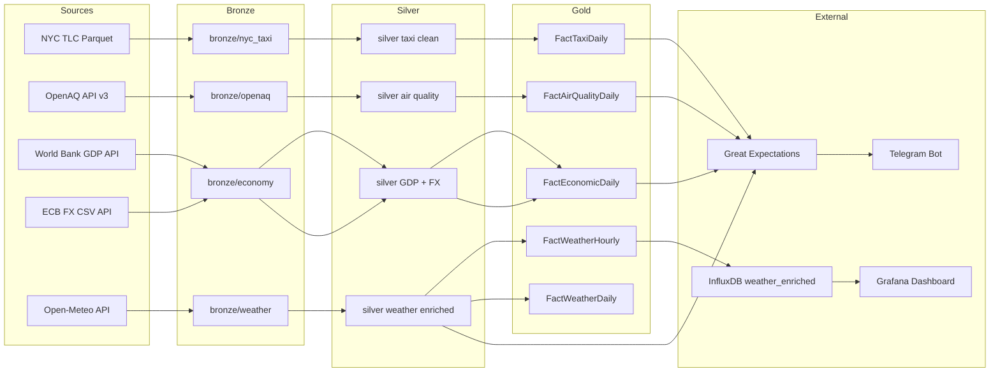

# Lineage

```mermaid
flowchart LR
  subgraph Sources
    A[NYC TLC Parquet]
    B[OpenAQ API v3]
    C[World Bank GDP API]
    D[ECB FX CSV API]
    E[Open-Meteo API]
  end

  subgraph Bronze
    AB[bronze/nyc_taxi]
    BB[bronze/openaq]
    CB[bronze/economy]
    EB[bronze/weather]
  end

  subgraph Silver
    AS[silver taxi clean]
    BS[silver air quality]
    CS[silver GDP + FX]
    ES[silver weather enriched]
  end

  subgraph Gold
    AG[FactTaxiDaily]
    BG[FactAirQualityDaily]
    CG[FactEconomicDaily]
    EG1[FactWeatherHourly]
    EG2[FactWeatherDaily]
  end

  subgraph External
    TS[InfluxDB weather_enriched]
    G[Grafana Dashboard]
    GE[Great Expectations]
    BOT[Telegram Bot]
  end

  A --> AB --> AS --> AG
  B --> BB --> BS --> BG
  C --> CB --> CS --> CG
  D --> CB --> CS --> CG
  E --> EB --> ES --> EG1
  ES --> EG2

  EG1 --> TS --> G
  AG --> GE
  BG --> GE
  CG --> GE
  ES --> GE
  GE --> BOT
```
